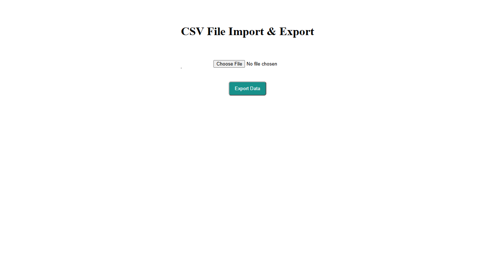

CSV Table Viewer

A simple JavaScript tool that allows you to upload a CSV file, view its contents in a table, and export the data back to a CSV file.

Features
Upload and read CSV files
Display CSV data in a table
Export the displayed data as a CSV file
Runs directly in the browser
No external libraries or dependencies
Technologies
HTML
CSS
JavaScript
FileReader API
Blob API
How It Works
Select a CSV file from your computer.
The file is read using the JavaScript FileReader API.
The CSV data is converted into rows and displayed in an HTML table.
Click the export button to download the table data as a new CSV file.
Project Structure
csv-table-viewer/
├── index.html
├── style.css
├── script.js
└── README.md

Getting Started

Clone the repository:

git clone https://github.com/ramsha1412/csv-import-export.git

Open index.html in your browser and upload a CSV file.

## Preview

Note

This project uses a simple comma-based CSV parser, so it is intended for basic CSV files. Complex CSV files containing commas inside quoted values may not be parsed correctly.

License

This project is open source and available under the MIT License.
